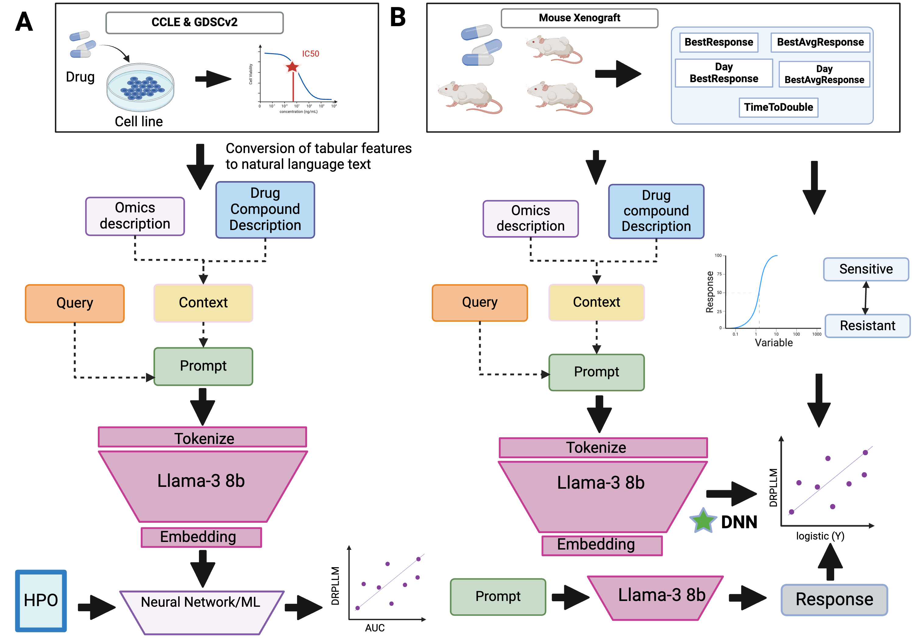

# DRPLLM: Drug Response Prediction Large Language Model

DRPLLM (Drug Response Prediction Large Language Model) is an innovative framework leveraging the power of large language models (LLMs) to predict drug responses in cancer using multi-omic data. By encoding complex biological and chemical relationships into natural language prompts, DRPLLM harnesses the robust feature extraction capabilities of LLMs, particularly Llama-3 with its 8 billion parameters, to offer enhanced predictive performance over traditional models. This approach has the potential to significantly advance personalized medicine and streamline drug discovery processes.

## Project Overview

The DRPLLM framework integrates various types of data—including genomic, transcriptomic, and drug properties—into a cohesive model that predicts how cancer cells respond to different treatments. This method not only captures the intrinsic complexity of tumor biology but also adapts to the unique challenges posed by therapies such as monoclonal antibodies, where specific compound information may be limited.

## Methodology



The DRPLLM architecture involves several key steps:

1. **Data Integration**: Multi-omic features along with drug compound characteristics are collated.
2. **Prompt Engineering**: These features are transformed into carefully designed prompts that simulate a natural language understanding task for the LLM.
3. **Embedding Extraction**: Llama-3 processes these prompts, and embeddings from the last hidden layer are extracted as rich, nuanced features for drug response prediction.
4. **Model Training**: The embeddings are then used as inputs to train four types of regression models—Linear Regression, Multi-Layer Perceptron (MLP), XGBoost, and a Deep Neural Network (DNN).
5. **Evaluation**: The models are evaluated based on their ability to predict drug responses, using metrics like the Spearman rank correlation coefficient (SCC) and area under the curve (AUC) from datasets such as CCLE and GDSCv2.

## Results

Initial results have demonstrated that DRPLLM can effectively predict drug responses with a high degree of accuracy. The DNN model, in particular, showed superior performance, suggesting that deep learning combined with LLM-derived features can provide significant advantages in predictive accuracy and generalizability.

## Contributions and Feedback

This project is the result of a collaborative effort during a two-day hackathon at Argonne and was further refined for submission to the AMIA 2025 informatics summit. We appreciate all contributions and welcome feedback to enhance the manuscript further.

## Setup and Usage

```bash
# Clone the repository
git clone https://github.com/dimi-lab/drpllm.git
cd drpllm

# Install dependencies
pip install -r requirements.txt

# generate embeddings
python create_llama_emb_multigpu.py

# Evaluate the models
python DDRPM_model.py
